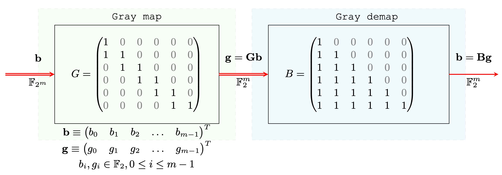

```@meta
CurrentModule = GrayCoding
```

# GrayCoding

Documentation for [GrayCoding](https://github.com/nivupai/GrayCoding.jl).

# Introduction

Welcome to the documentation for GrayCoding!

## What is GrayCocoding.jl?

[GrayCoding](https://github.com/nivupai/GrayCoding.jl) is a formal Linear Algebraic framework for ``q``-ry Gray Code.
Encoding and Decooding of Gray codes can be treated as a special case of algebraic block coding.

* Encoding: ``\textbf{g}=G \textbf{b} ``
* Decoding: ``\textbf{b}=B \textbf{g} ``



!!! tip
    This is still under active devlopment.

## Resources for getting started

There are few ways to get started with GrayCoding:

## Installation

Open a Julia session and enter

```julia
using Pkg; Pkg.add("GrayCoding")
```

this will download the package and all the necessary dependencies for you. Next you can import the package with

```julia
using GrayCoding
```

and you are ready to go.

## Quickstart

```julia
using GrayCoding
```


## Citation

If you use this package in your work, please cite it as
```
@software{nrethnakar2022GrayAlgebra,
author = {
            Nivedita Rethnakar 
         },
title  = {GrayCoding.jl: Algebra of Gray Coding and Applications},
month  = {1},
year   = {2022},
doi    = {10.5281/zenodo.5989996},
url    = {https://github.com/nivupai/GrayCoding.jl}
}
```


* Read TBD.


```@index
```

```@autodocs
Modules = [GrayCoding]
```
