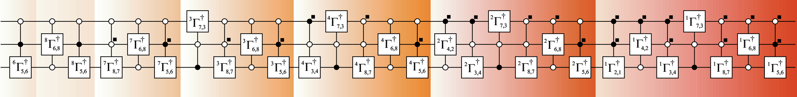

# Quantum Computing
Broadly stated, the term quantum computation comprieses of the following three elements:
* A register or a set of registers,
* A unitary matrix ``U``, as an abstract representation of the quantum algorithm,
* Measurements to extract the information of interest.

As a mathematial abstraction, a quantum computation is the set ``\{\mathcal{H},U,\{Mm\}\}``, where ``H = \mathbb{C}^{2^{n}}`` is the Hilbert space of an ``n-``qubit register, ``U \in U\left(2^{n}\right)`` represents the quantum algorithm and ``\{M_{m}\}`` is the set of measurement operators. The hardware circuitry along with equipment to control and manipulate the qubits is called a quantum computer.

!!! info "More on Quantum Computation Information"
    Quantum Computing is a fascinating subject. In this, we cover only the very basic things to connect the Gray Code framework that we've devloped to Quantum circuits. The classic book on this subject by Michael A. Nielsen’s and Isaac L. Chuang titled “Quantum Computation and Quantum Information” is the go to place for more (Michael A. Nielsen and Isaac L. Chuang. Quantum Computation and Quantum Information. Cambridge University Press (2000)). 


# Single qubit gates
These are the simplest set of gates which take one qubit as an input, act upon (change the state) and produce a qubit at the output.

A  generic 1-qubit quantum gate corresponds to a ``2 \times 2`` unitary matrix, which has the following form:
```math
U = e^{\imath \theta} \begin{pmatrix} a & -b^{*} \\\ b & a^{*} \end{pmatrix} 
```
where ``a,b \in \mathbb{C}`` such that ``\lvert a \rvert^{2}+ \lvert b \rvert^{2} = 1``, and ``\alpha \in \mathbb{R}`` results in arbitrary rotation. This matrix is essentially a `Givens` rotation matrix [Wikipedia](https://en.wikipedia.org/wiki/Givens_rotation). 


## Examples
###  ``X`` gate.

*  This gate *flips* the state of the qubit. In other words, it changes the state of the qubit from `` a\vert 0 \rangle + b\vert 1 \rangle`` to `` a\vert 1 \rangle+ b\vert 0 \rangle ``. 
*  The matrix representation for``X`` gate is, `` \sigma_{x}=\begin{pmatrix} 0 & 1 \\\ 1 & 0 \end{pmatrix} ``.  Multiplying the vector representing the qubit to the matrix is equivalent to the gate operation. i.e., `` \begin{pmatrix} b \\\ a \end{pmatrix} =\begin{pmatrix} 0 & 1 \\\ 1 & 0 \end{pmatrix} \begin{pmatrix} a \\\ b \end{pmatrix} `` 

###  ``Y`` gate.
*  This gate perform two *flips* (a *bit flip* and a *phase flip*) on the state of the qubit. In other words, it changes the state of the qubit from `` a\vert 0 \rangle + b\vert 1 \rangle``, to `` b\vert 0 \rangle - a\vert 1 \rangle``. 
*  The matrix representation for``Y`` gate is, `` \sigma_{y}=\begin{pmatrix} 0 & -1 \\\ 1 & 0  \end{pmatrix} ``.  Multiplying the vector representing the qubit to the matrix is equivalent to the gate operation. 

###  ``Z`` gate.

*  This gate performs a *sign flip* on the state of the qubit. In other words, it changes the state of the qubit from `` a\vert 0 \rangle + b\vert 1 \rangle``, to `` a\vert 0 \rangle - \vert 1 \rangle``. 
*  The matrix representation for ``X`` gate is, `` \sigma_{z}=\begin{pmatrix} 1 & 0 \\\ 0 & -1 \end{pmatrix} ``.  Multiplying the vector representing the qubit to the matrix is equivalent to the gate operation. 

The matrix representations `` \sigma_{x}, \;\sigma_y\;and\; \sigma_z `` are known as Pauli's matrices.

### Hadamard gate: ``H`` gate

* This gate works as follows: ``\vert 0 \rangle`` changes to `` \frac{1}{\sqrt2}(\vert 0 \rangle +\; \vert 1 \rangle) ``, and the ``\vert 1 \rangle`` changes to `` \frac{1}{\sqrt2}(\vert 0 \rangle - \vert 1 \rangle)``. 
* For an example, `` a\vert 0 \rangle + b\vert 1 \rangle, `` changes to, `` \frac{a}{\sqrt2}(\vert 0 \rangle + \vert 1 \rangle) +  \frac{b}{\sqrt2}(\vert 0 \rangle - \vert 1 \rangle)``. 
* It can be simplified to give, ``\frac{a+b}{\sqrt2}\vert 0 \rangle + \frac{a-b}{\sqrt2} \vert 1 \rangle``.

Mathematically, the following transformation captures the essence of ``H`` gate.
```math
\begin{pmatrix} \frac{a+b}{\sqrt2} \\\\ \frac{a-b}{\sqrt2} \end{pmatrix} = \frac{1}{\sqrt2} \begin{pmatrix} 1 & 1 \\\ 1 & -1 \end{pmatrix} \begin{pmatrix} a \\\ b \end{pmatrix}
```

# Decomposition of Quantum Gates

## Two level decomposition
A 2-level unitary correspond to unitary operation that non-trivially perform on only 2 of the states. Any controlled 1-qubit  gate can be abstracted into a 2-level unitary matrix, e.g. for a single qubit gate ``U = \begin{pmatrix} a & b \\\\ c & d \end{pmatrix}``.


## Universal Decomposition
Any arbitrary unitary gate acting on n-qubit can be implemented as a cascade of single-qubit and controlled-NOT (CNOT) gates.

```math
\textbf{U}|\psi \rangle = \begin{pmatrix} u_{11} & u_{12} & \ldots & u_{1,N} \\ u_{11} & u_{12} & \ldots & u_{1,N} \end{pmatrix}
```

## CNOT gates
 CNOT stands for Controlled-NOT, which is one of the key quantum logic gate. It is a two qubit gate. The gate flips the second qubit (called the target qubit) when the first gate (the control gate) is ``\lvert 1 \rangle``, while the target qubit remain unchanged when the control gate is in state ``\lvert 0 \rangle``.


```math
\begin{aligned}
 U_{\text{CNOT}} &= \lvert 0 \rangle \otimes \langle 0 \rvert \otimes \begin{pmatrix} 1 & 0 \\ 0 & 1 \end{pmatrix} + \lvert 1 \rangle \otimes \langle 1 \rvert \otimes \begin{pmatrix} 1 & 0 \\ 0 & 1 \end{pmatrix}\\
                 &= \lvert 0 \rangle \langle 0 \rvert \otimes \begin{pmatrix} 1 & 0 \\ 0 & 1 \end{pmatrix} + \lvert 1 \rangle  \langle 1 \rvert \otimes \begin{pmatrix} 1 & 0 \\ 0 & 1 \end{pmatrix}\\
                 &= \begin{pmatrix} 1 & 0 & 0 & 0 \\ 0 & 1 & 0 & 0 \\ 0 & 0 & 0 & 1 \\ 0 & 0 & 1 & 0\end{pmatrix} 
 \end{aligned}
```

In terms of Gray matrix, we can also simply express this as,
```math
\begin{aligned}
\begin{pmatrix} \lvert \acute{\psi}_{1} \rangle \\ \lvert \acute{\psi}_{2} \rangle \end{pmatrix} &= G_{2} \begin{pmatrix} \lvert \psi_{1} \rangle \\ \lvert \psi_{2} \rangle \end{pmatrix} \\
&= \begin{pmatrix} 1 & 0 \\ 1 & 1 \end{pmatrix} \begin{pmatrix} \lvert \psi_{1} \rangle \\ \lvert \psi_{2} \rangle \end{pmatrix}
\end{aligned}
```

---
The simplest CNOT gate is the single qubit controlled CNOT discussed above, which can be explicitly denoted as ``C^{1}\text{NOT}``. Generalization of this to multi quibit controlled CNOT, denoted by ``C^{n-1}\text{NOT}``.
---

In quantum circuit design, applying a rotation for which the binary representations of i − 1 and j − 1 differ in a single bit can be accomplished by a single fully-controlled one-qubit rotation (a particular Givens rotation) and hence costs a small number of gates. All other rotations require a permutation of data before the rotation is applied and thus should be avoided.

### Generic U decomposion 
#### Examples: 3 cubit generic quantum gate

```julia-repl
julia> A1,A2,A3,A4=sequenceΓ(3);
julia> A4
3×28 adjoint(::Matrix{Int64}) with eltype Int64:
 6  8  8  7  7  7  3  3  3  3  4  4  4  4  4  2  2  2  2  2  2  1  1  1  1  1  1  1
 5  6  5  8  6  5  7  8  6  5  3  7  8  6  5  4  3  7  8  6  5  2  4  3  7  8  6  5
 6  8  6  7  8  6  3  7  8  6  4  3  7  8  6  2  4  3  7  8  6  1  2  4  3  7  8  6
```

