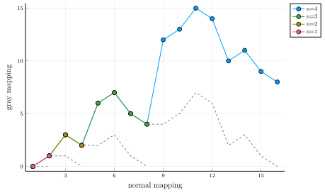
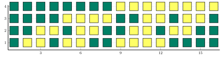
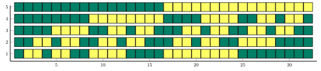

# Examples

## Recursive construction


### Recursive procedure


Reflect ``C[n-1]``, shift by ``q^{n-1}`` and augment (TBD).

Gray code ``g[n]`` can be recursively constructed as follows.
Start with ``g[1] = (0,1)`` and for ``N=2^n, n \ge 1``,
Let ``g[n] = \left(x_{1},\ldots,x_{N−1},x_{N}\right)``, 
```math
g[n+1] = \left(0x_{1},\ldots,0x_{N−1},0x_{N},1x_{N},1g_{N−1},...,1x_{1}\right).
```

## Illustration
```julia-repl
using Plots
function plotmatrix(A;kwargs...)
    a,b=size(A)
    X = transpose(repeat(1:b, 1, a))[:]
    Y = repeat(a:-1:1, b)[:]
	scatter(X,Y, marker_z = A[:], marker=:rect,markersize = 4,  color = :viridis,aspectratio=1,ylims=[0,size(G,1)+1],alpha=1,label=:none,colorkey=:none,axis=:none;kwargs...)

julia> plotmatrix(gray(6));
julia> plotmatrix(G,size=(800,400),color=:summer)
julia> plotmatrix(G,size=(800,200),color=:summer,markersize=7,xlims=[1,size(G,2)+0],ylims=[1/2,size(G,1)-0])
end
```




## Linear Algebraic method
TBD
``g=Gb`` and ``b=Bg``, where ``G`` is a Jordan matrix, which is 

```julia-repl
julia> n,q=4,2
julia> GrayCoding.GrayMatrix(n,q)
4×4 Matrix{Int64}:
 1  0  0  0
 1  1  0  0
 1  1  1  0
 1  1  1  1
4×4 Matrix{Int64}:
 1  0  0  0
 1  1  0  0
 0  1  1  0
 0  0  1  1
4×16 Matrix{Int64}:
 0  0  0  0  0  0  0  0  1  1  1  1  1  1  1  1
 0  0  0  0  1  1  1  1  0  0  0  0  1  1  1  1
 0  0  1  1  0  0  1  1  0  0  1  1  0  0  1  1
 0  1  0  1  0  1  0  1  0  1  0  1  0  1  0  1
4×16 Matrix{Int64}:
 0  0  0  0  0  0  0  0  1  1  1  1  1  1  1  1
 0  0  0  0  1  1  1  1  1  1  1  1  0  0  0  0
 0  0  1  1  1  1  0  0  0  0  1  1  1  1  0  0
 0  1  1  0  0  1  1  0  0  1  1  0  0  1  1  0

julia> G,B,g,b=GrayCoding.GrayMatrix(10,5);
julia> G
10×10 Matrix{Int64}:
 1  0  0  0  0  0  0  0  0  0
 1  1  0  0  0  0  0  0  0  0
 1  1  1  0  0  0  0  0  0  0
 1  1  1  1  0  0  0  0  0  0
 1  1  1  1  1  0  0  0  0  0
 1  1  1  1  1  1  0  0  0  0
 1  1  1  1  1  1  1  0  0  0
 1  1  1  1  1  1  1  1  0  0
 1  1  1  1  1  1  1  1  1  0
 1  1  1  1  1  1  1  1  1  1
 julia>B
 10×10 Matrix{Int64}:
 1  0  0  0  0  0  0  0  0  0
 4  1  0  0  0  0  0  0  0  0
 0  4  1  0  0  0  0  0  0  0
 0  0  4  1  0  0  0  0  0  0
 0  0  0  4  1  0  0  0  0  0
 0  0  0  0  4  1  0  0  0  0
 0  0  0  0  0  4  1  0  0  0
 0  0  0  0  0  0  4  1  0  0
 0  0  0  0  0  0  0  4  1  0
 0  0  0  0  0  0  0  0  4  1
```