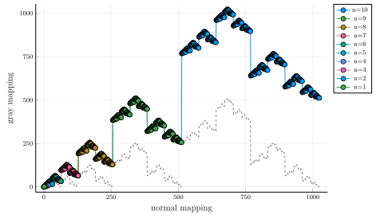
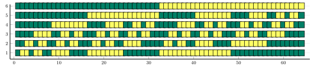

# Examples

## Recursive construction


### Recursive procedure


Reflect ``C[n-1]``, shift by ``q^{n-1}`` and augment (TBD).


For ``n \in \mathbb{N}``, positive integer and ``N = 2^{n}``. A Gray code ``G_{n}`` is an tuple ``G_{n} = (X_{1},X_{2},...,X_{N})`` which satisfies the following properties:
* ``X_{1}, X_{2}, ... , X_{N}`` are binary sequences (of length ``n``) corresponding to the binary representation of the numbers ``0, 1, \ldots , N − 1``, arranged in a specific order,
*  For any `` 0 \le j \le N-1``, adjacent pairs ``X_{j},X_{j+1}`` differ in only one position (i.e., only one of the ``n`` bits would differ),
* The start and end sequences (i.e., sequences ``X_{1}`` and ``X_{N}`` differ in just one position.

Gray code ``G_{n}`` can be recursively constructed as follows.
Start with ``G_{1} = (0,1)`` and for ``N=2^n, n \ge 1``,
Let ``G_{n} = \left(X_{1},\ldots,X_{N−1},X_{N}\right)``, 
```math
G_{n+1} = \left(0X_{1},\ldots,0X_{N−1},0X_{N},1X_{N},1X_{N−1},...,1X_{1}\right).
```

## Illustration
```julia-repl
using Plots
function plotmatrix(A;kwargs...)
    a,b=size(A)
    X = transpose(repeat(1:b, 1, a))[:]
    Y = repeat(a:-1:1, b)[:]
	scatter(X,Y, marker_z = A[:], marker=:rect,markersize = 4,  color = :viridis,aspectratio=1,ylims=[0,size(G,1)+1],alpha=1,label=:none,colorkey=:none,axis=:none;kwargs...)

julia> plotmatrix(gray(6));
julia> plotmatrix(G,size=(800,400),color=:summer)
julia> plotmatrix(G,size=(800,200),color=:summer,markersize=7,xlims=[1,size(G,2)+0],ylims=[1/2,size(G,1)-0])
end
```
#### Binary Gray Code ``n=4``


#### Binary Gray Code ``n=5``


#### Binary Gray Code ``n=6``


## Linear Algebraic method
TBD
``g=Gb`` and ``b=Bg``, where ``G`` is a Jordan matrix, which is 

```julia-repl
julia> n,q=4,2
julia> GrayCoding.GrayMatrix(n,q)
4×4 Matrix{Int64}:
 1  0  0  0
 1  1  0  0
 1  1  1  0
 1  1  1  1
4×4 Matrix{Int64}:
 1  0  0  0
 1  1  0  0
 0  1  1  0
 0  0  1  1
4×16 Matrix{Int64}:
 0  0  0  0  0  0  0  0  1  1  1  1  1  1  1  1
 0  0  0  0  1  1  1  1  0  0  0  0  1  1  1  1
 0  0  1  1  0  0  1  1  0  0  1  1  0  0  1  1
 0  1  0  1  0  1  0  1  0  1  0  1  0  1  0  1
4×16 Matrix{Int64}:
 0  0  0  0  0  0  0  0  1  1  1  1  1  1  1  1
 0  0  0  0  1  1  1  1  1  1  1  1  0  0  0  0
 0  0  1  1  1  1  0  0  0  0  1  1  1  1  0  0
 0  1  1  0  0  1  1  0  0  1  1  0  0  1  1  0

julia> G,B,g,b=GrayCoding.GrayMatrix(10,5);
julia> G
10×10 Matrix{Int64}:
 1  0  0  0  0  0  0  0  0  0
 1  1  0  0  0  0  0  0  0  0
 1  1  1  0  0  0  0  0  0  0
 1  1  1  1  0  0  0  0  0  0
 1  1  1  1  1  0  0  0  0  0
 1  1  1  1  1  1  0  0  0  0
 1  1  1  1  1  1  1  0  0  0
 1  1  1  1  1  1  1  1  0  0
 1  1  1  1  1  1  1  1  1  0
 1  1  1  1  1  1  1  1  1  1
 julia>B
 10×10 Matrix{Int64}:
 1  0  0  0  0  0  0  0  0  0
 4  1  0  0  0  0  0  0  0  0
 0  4  1  0  0  0  0  0  0  0
 0  0  4  1  0  0  0  0  0  0
 0  0  0  4  1  0  0  0  0  0
 0  0  0  0  4  1  0  0  0  0
 0  0  0  0  0  4  1  0  0  0
 0  0  0  0  0  0  4  1  0  0
 0  0  0  0  0  0  0  4  1  0
 0  0  0  0  0  0  0  0  4  1
```